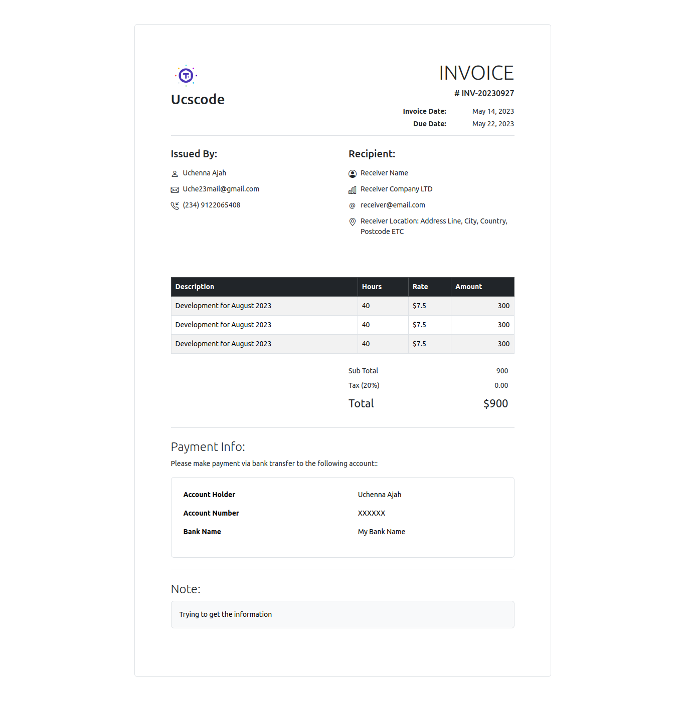

# Ucscode Invoice Maker Documentation

This documentation explains how to use the PHP invoice generator classes to create and customize invoices. The PHP classes provided here allow you to create professional invoices with custom headers, client information, tables, and notes.

## Screenshot



## Installation

Before you can use the invoice generator, make sure you include the required `invoice-compiler.php` file in your PHP script. Here's an example of how to include it:

```php
require_once __DIR__ . "/invoice-compiler.php";
```

## Creating an Invoice

To create a new invoice, instantiate the `UcsInvoice` class and provide a unique invoice ID as a parameter. For example:

```php
$invoice = new UcsInvoice('INV-20230927');
```

## Configuring Invoice Header

You can configure the invoice header by creating an instance of the `InvoiceHeader` class and setting various attributes like title, logo, date, and due date. Here's an example:

```php
$header = new InvoiceHeader();

$header->title = "Ucscode";
$header->logo = "https://www.cdnlogo.com/logos/t/74/t3.svg";
$header->date = new DateTimeImmutable("2023-05-14");
$header->dueDate = new DateTimeImmutable("2023-05-22");

$invoice->setInvoiceHeader($header);
```

## Configuring Invoice Clients

You can specify information for both the issuer (person or company issuing the invoice) and the recipient (person or company receiving the invoice) by creating instances of the `InvoiceClient` class. You can set attributes like name, email, phone, and more. Here's an example:

```php
$issuer = (new InvoiceClient("Issued By"))
    ->set("name", "Uchenna Ajah", "bi bi-person")
    ->set("email", "Uche23mail@gmail.com", "bi bi-envelope")
    ->set("phone", "(234) 9122065408", "bi bi-telephone-inbound");

$recipient = (new InvoiceClient("Recipient"))
    ->set("name", "Receiver Name", "bi bi-person-circle")
    ->set("company", "Receiver Company LTD", "bi bi-buildings")
    ->set("email", "receiver@email.com", "bi bi-at")
    ->set("address", "Receiver Location: Address Line, City, Country, Postcode ETC", "bi bi-geo-alt");

$invoice->addInvoiceClient($issuer);
$invoice->addInvoiceClient($recipient);
```

You can add as many `InvoiceClient` instances as you need for your invoice.

## Configuring Invoice Table

The `InvoiceTable` class allows you to create and customize the table within your invoice. You can set table headers, add data rows, format the data, and calculate bill amounts. Here's an example:

```php
$table = new InvoiceTable();

// Define the table columns
$table->setHeader(['description', 'hours', 'rate', 'amount']);

// Create rows for each column
$table->setData([
    ['Development for August 2023', 40, 7.5, null],
    ['Development for August 2023', 40, 7.5, null],
    ['Development for August 2023', 40, 7.5, null],
]);

// Dynamically re-format the data for each row
$table->formatData(function(array $data) {
    $data[3] = $data[1] * $data[2];
    $data[2] = '$' . $data[2];
    return $data;
});

// Add bill information
$table->addBill('Sub Total', function(array $allData, array $allBills) {
    return array_sum(array_column($allData, 3));
});

$table->addBill('Tax (20%)', '0.00');

$table->addBill('Total', function(array $allData, array $allBills) {
    return '$' . array_sum(array_column($allBills, 'value')); 
}, ['class' => 'fs-22px']);

$invoice->setInvoiceTable($table);
```

You can add as many rows and bill information items as needed.

## Configuring Invoice Notes

You can include additional notes in your invoice using the `InvoiceNote` class. You can specify the title and content of each note. Here's an example:

```php
$payment = new InvoiceNote('Payment Info');

$payment->description = "Please make payment via bank transfer to the following account:";

$payment->content = "
    <table class='table table-borderless'>
        <tbody>
            <tr>
                <th>Account Holder</th>
                <td>Uchenna Ajah</td>
            </tr>
            <tr>
                <th>Account Number</th>
                <td>XXXXXX</td>
            </tr>
            <tr>
                <th>Bank Name</th>
                <td>My Bank Name</td>
            </tr>
        </tbody>
    </table>
";

$invoice->addInvoiceNote($payment);
```

You can create as many additional notes as needed using the `InvoiceNote` class.

## Rendering the Invoice

To generate and render the invoice, you can use the `render` method. Pass `true` as a parameter to display the invoice directly in the browser, or pass `false` to return the invoice as a string. For example:

```php
$invoice->render(true); // Display the invoice in the browser
// OR
$invoiceString = $invoice->render(false); // Get the invoice as a string
```

That's it! You have successfully configured and generated an invoice using the Ucscode invoice generator classes. Customize the invoice to your specific needs by adjusting the header, client information, table data, and notes as required.